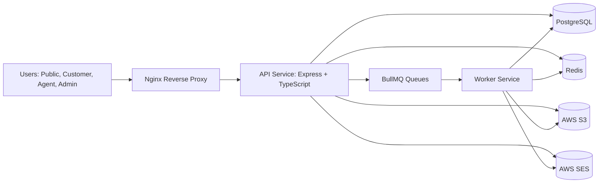
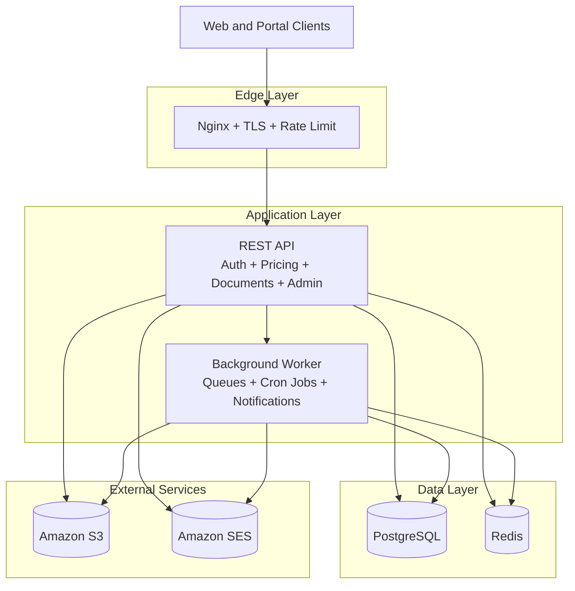
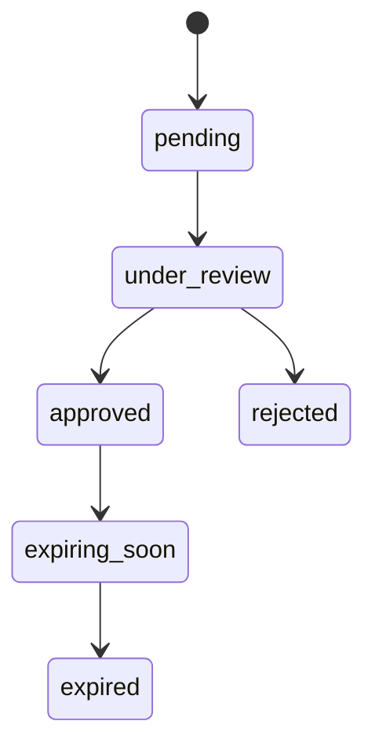
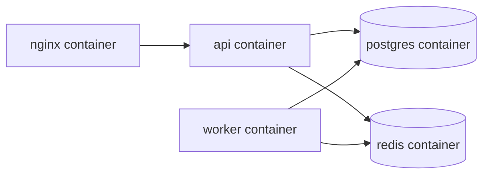

# ConstDocManagment

Enterprise-ready backend architecture for a construction and compliance services platform.

This project provides a scalable API and worker-based backend for:

- Public quotation and pricing workflows
- Customer document management and subscription lifecycle
- Admin and agent review operations
- Automated notifications, reminders, and scheduled jobs

## What This System Does

- Public website support with dynamic pricing calculator APIs
- Customer portal APIs for documents, subscriptions, and invoices
- Admin and agent APIs for approvals, pricing, and analytics
- JWT authentication with role-based access control
- Redis-backed job queues for reminders and asynchronous processing
- Docker-first deployment model for local and EC2 production environments

## User Roles

| Role | Access | Key Permissions |
|---|---|---|
| customer | Customer portal | Upload documents, view invoices, track subscriptions |
| agent | Agent portal | Review and update customer documents |
| manager | Manager portal | Agent capabilities plus operational visibility |
| admin | Full platform access | Pricing, users, reports, and platform configuration |

## Core Tech Stack

### Runtime and API

- Node.js 20
- Express 4
- TypeScript 5
- ts-node-dev (development hot reload)

### Security and Auth

- jsonwebtoken
- bcryptjs
- helmet
- cors
- express-rate-limit

### Data Layer

- PostgreSQL 16
- TypeORM
- pg
- Redis 7
- ioredis

### Async Processing

- BullMQ
- node-cron
- nodemailer
- Handlebars
- AWS SDK (S3 + SES)

### Validation and API Contracts

- zod
- Central response envelope pattern

### Dev and Quality

- eslint
- prettier
- jest
- supertest

## High-Level System Design



## Best System Design Diagram

This is the primary architecture view for GitHub and technical presentations.



## Request Processing Pipeline

```mermaid
flowchart LR
	REQ[Incoming Request] --> H[helmet]
	H --> C[cors]
	C --> G[compression]
	G --> J[express.json]
	J --> M[morgan]
	M --> RL[rate limiter]
	RL --> AUTH[authenticate]
	AUTH --> AUTHZ[authorize roles]
	AUTHZ --> V[validate zod schema]
	V --> BH[business handler]
	BH --> RESP[standard JSON envelope]
```



## Document Status State Machine



Rules:

- Only agent or admin roles can transition review states
- Every transition is auditable through status history entries
- State flow is forward-only

## API Design Summary

All APIs follow REST conventions with a shared envelope.

Success envelope:

```json
{ "success": true, "data": {}, "message": "ok" }
```

Error envelope:

```json
{ "success": false, "error": "Not found", "code": 404 }
```

### Auth Endpoints

| Method | Endpoint | Auth | Description |
|---|---|---|---|
| POST | /api/auth/register | Public | Customer registration |
| POST | /api/auth/login | Public | Issue access and refresh tokens |
| POST | /api/auth/refresh | Refresh token | Issue a new access token |
| POST | /api/auth/logout | Bearer | Revoke refresh token |
| POST | /api/auth/forgot-password | Public | Trigger reset flow |
| POST | /api/auth/reset-password | Reset token | Set new password |

### Customer Endpoints

| Method | Endpoint | Auth | Description |
|---|---|---|---|
| GET | /api/customers/me | customer | Own profile |
| GET | /api/customers/me/documents | customer | List own documents |
| POST | /api/documents/upload-url | customer | Get S3 upload URL |
| GET | /api/documents/:id/download-url | customer | Get S3 download URL |
| GET | /api/customers/me/subscriptions | customer | Subscription history |
| GET | /api/customers/me/invoices | customer | Invoice listing |

### Quotation and Pricing Endpoints

| Method | Endpoint | Auth | Description |
|---|---|---|---|
| POST | /api/quotations/calculate | Public | Price breakdown without login |
| POST | /api/quotations | customer | Save quotation |
| GET | /api/quotations/:id | customer or admin | Get quotation |
| GET | /api/pricing/worker-ranges | Public | Worker-tier pricing |
| GET | /api/pricing/locations | Public | Location multipliers |
| GET | /api/pricing/services | Public | Service catalog |
| GET | /api/packages | Public | Available packages |

### Admin Endpoints

| Method | Endpoint | Auth | Description |
|---|---|---|---|
| GET | /api/admin/users | admin | User list and filters |
| PATCH | /api/admin/users/:id | admin | Update role and status |
| GET | /api/admin/documents | admin or agent | Review queue |
| PATCH | /api/admin/documents/:id/status | admin or agent | Approve or reject document |
| GET | /api/admin/subscriptions | admin | Subscription overview |
| POST | /api/admin/pricing/worker-ranges | admin | Update worker tiers |
| POST | /api/admin/pricing/locations | admin | Update location pricing |
| GET | /api/admin/analytics | admin or manager | Revenue and renewals |

## Repository Layout

```text
constDocManagment/
├── apps/
│   ├── api/
│   └── worker/
├── nginx/
├── docker/
├── .github/workflows/
├── compose.yml
├── compose.prod.yml
├── .env.example
└── tsconfig.base.json
```

## Containers and Deployment



Environment modes:

- Development: compose.yml
- Production: compose.prod.yml

## Quick Start

1. Clone repository.
2. Copy .env.example to .env and set values.
3. Build and run with Docker Compose.

```bash
docker compose -f compose.yml up --build -d
```

4. Verify services.

```bash
docker compose ps
```

## Security Highlights

- Short-lived JWT access tokens and refresh-token flow
- Role-based authorization per route
- Input validation with Zod
- Security headers and CORS policy
- Centralized rate limiting and request logging
- Dockerized execution to reduce environment drift

## Project Status

This repository currently contains a strong backend scaffold with production-style structure, middleware flow, and deployment setup. It is ready for iterative feature completion and database migration rollout.